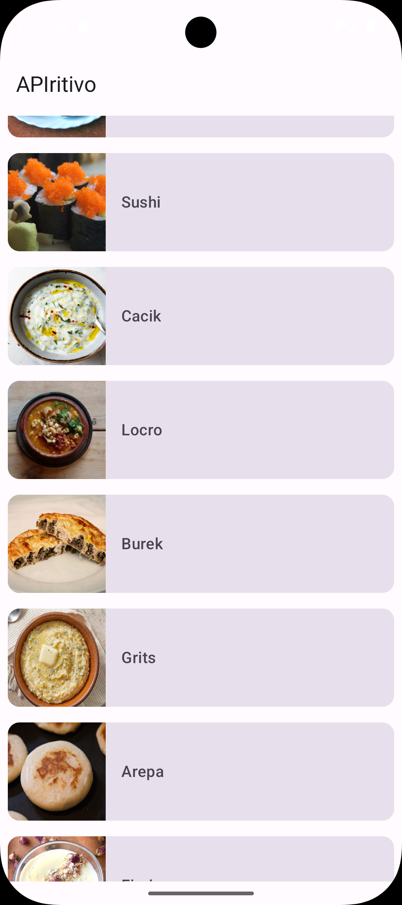
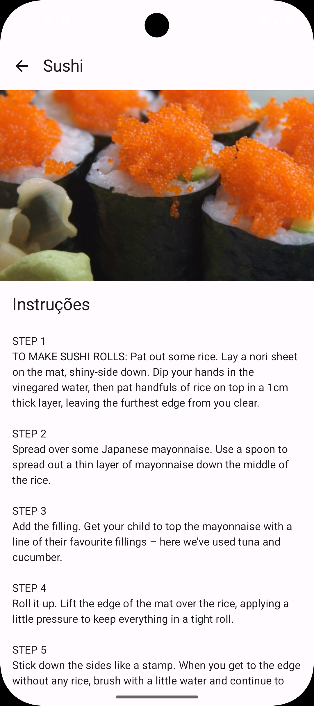

# APIritivo 🍽️

Aplicativo Android para consulta de receitas culinárias, desenvolvido com Kotlin, Jetpack Compose, MVVM e integração com a API TheMealDB.


## 📋 Sobre o projeto

O **APIritivo** é um aplicativo Android nativo que permite consultar receitas disponibilizadas pela API pública [TheMealDB](https://www.themealdb.com/).

A aplicação apresenta um catálogo com imagem e nome dos pratos. Ao selecionar uma receita, o usuário pode visualizar sua imagem ampliada e as instruções de preparo.

O projeto foi desenvolvido com foco em consumo de API REST, gerenciamento de estados da interface, navegação entre telas, injeção de dependências e testes unitários da camada de apresentação.

## 📸 Screenshots

| Catálogo de receitas | Detalhes da receita |
|---|---|
|  |  |

## 🎥 Demonstração

Confira o aplicativo em funcionamento, demonstrando o carregamento das receitas, a navegação para os detalhes, o tratamento dos estados da interface e a recuperação após falhas de rede.

<video src="https://github.com/user-attachments/assets/7ce9a04a-df10-4185-b41c-16e707e6af8f" controls="controls" style="max-width: 100%; height: auto;">
  Seu navegador não suporta a reprodução do vídeo.
</video>

## ✨ Funcionalidades

- **Catálogo de receitas:** listagem dos pratos obtidos pela API TheMealDB.
- **Detalhes da receita:** exibição da imagem, do nome e das instruções de preparo.
- **Carregamento de imagens:** obtenção assíncrona das imagens com Coil.
- **Estado de carregamento:** apresentação de indicador enquanto os dados são buscados.
- **Tratamento de erros:** mensagem específica quando ocorre uma falha na requisição.
- **Tentativa de recuperação:** botão para repetir o carregamento após erros de rede.
- **Navegação entre telas:** transição entre o catálogo e os detalhes utilizando Navigation Compose.
- **Interface reativa:** atualização da tela a partir dos estados emitidos pelo ViewModel.

## 🏗️ Arquitetura

O projeto utiliza o padrão de apresentação **MVVM — Model-View-ViewModel**, separando a interface, o gerenciamento de estado e o acesso aos dados.

### Model

Representa os dados recebidos da API, incluindo:

- identificador da receita;
- nome do prato;
- endereço da imagem;
- instruções de preparo.

### ViewModel

O `RecipeViewModel` é responsável por:

- iniciar o carregamento das receitas;
- realizar a chamada à API;
- validar a resposta recebida;
- tratar falhas de rede;
- disponibilizar o estado da interface por meio de `StateFlow`.

### View

As telas foram construídas com Jetpack Compose:

- `RecipeListScreen`: apresenta o catálogo e os estados de carregamento e erro;
- `RecipeDetailScreen`: apresenta a imagem e as instruções da receita selecionada.

### Estados da interface

O estado da tela é representado por uma `sealed class`:

```kotlin
sealed class RecipeUiState {
    object Loading : RecipeUiState()
    data class Success(val recipes: List<Meal>) : RecipeUiState()
    data class Error(val message: String) : RecipeUiState()
}
```

Essa modelagem permite que a interface represente de forma explícita os possíveis resultados da operação.

## 🛠️ Tecnologias utilizadas

| Tecnologia | Versão | Aplicação no projeto |
|---|---:|---|
| **Kotlin** | 2.0.21 | Linguagem principal do aplicativo. |
| **Jetpack Compose** | BOM 2024.04.01 | Construção declarativa das telas. |
| **Material Design 3** | Gerenciada pelo BOM | Componentes e estilos da interface. |
| **MVVM** | — | Separação entre interface, estado e acesso aos dados. |
| **StateFlow** | — | Gerenciamento reativo do estado da interface. |
| **Kotlin Coroutines** | 1.7.3 nos testes | Execução das operações assíncronas. |
| **Retrofit** | 2.9.0 | Comunicação com a API REST. |
| **Gson Converter** | 2.9.0 | Conversão das respostas JSON em objetos Kotlin. |
| **Dagger Hilt** | 2.51.1 | Injeção das dependências de rede. |
| **Navigation Compose** | 2.7.5 | Navegação entre o catálogo e os detalhes. |
| **Coil Compose** | 2.5.0 | Carregamento assíncrono das imagens. |
| **JUnit 4** | 4.13.2 | Execução dos testes unitários. |
| **MockK** | 1.13.8 | Simulação das respostas da API nos testes. |
| **Turbine** | 1.0.0 | Suporte à validação de fluxos em testes. |

## 💡 API utilizada

O aplicativo consome a API pública **TheMealDB**.

A requisição utilizada pelo projeto consulta o catálogo de receitas pelo endpoint:

```text
https://www.themealdb.com/api/json/v1/1/search.php?s=
```

Como esse endpoint não exige uma chave de autenticação no fluxo implementado, o projeto pode ser executado sem configurações adicionais de credenciais.

## 📂 Estrutura do projeto

```text
app/src/main/java/com/example/apiritivo/
├── data/
│   ├── model/
│   │   ├── Meal.kt
│   │   └── MealResponse.kt
│   └── remote/
│       └── MealApi.kt
├── di/
│   └── NetworkModule.kt
├── ui/
│   ├── screens/
│   │   ├── RecipeListScreen.kt
│   │   └── RecipeDetailScreen.kt
│   └── viewmodel/
│       └── RecipeViewModel.kt
└── MainActivity.kt
```

## 🚧 Desafios técnicos e aprendizados

### 1. Representação dos estados da interface

**Desafio:** representar corretamente o carregamento, o resultado da API e as possíveis falhas de conexão sem espalhar várias variáveis de controle pela tela.

**Solução:** criação da `RecipeUiState` como uma `sealed class`, reunindo os estados `Loading`, `Success` e `Error`.

**Aprendizado:** modelar estados de forma explícita torna a interface mais previsível e reduz combinações inválidas de dados.

### 2. Recuperação após falhas de rede

**Desafio:** permitir que o usuário tente carregar novamente as receitas sem precisar reiniciar o aplicativo.

**Solução:** o estado de erro apresenta uma mensagem e o botão **Tentar Novamente**, que executa novamente o método `fetchRecipes()`.

**Aprendizado:** erros de rede devem ser tratados como parte do fluxo normal da aplicação, oferecendo feedback e uma ação de recuperação.

### 3. Validação da resposta da API

**Desafio:** uma resposta HTTP pode ser recebida sem garantir que a lista de receitas esteja disponível.

**Solução:** validação de `isSuccessful`, do corpo da resposta e da propriedade `meals` antes de emitir o estado de sucesso.

**Aprendizado:** a integração com APIs exige tratamento tanto para exceções de conexão quanto para respostas sem os dados esperados.

### 4. Injeção das dependências de rede

**Desafio:** evitar que o ViewModel fosse responsável por criar diretamente o Retrofit e a implementação da API.

**Solução:** configuração de um módulo do Dagger Hilt para fornecer instâncias de `Retrofit` e `MealApi`.

**Aprendizado:** a injeção de dependências reduz o acoplamento e facilita a substituição da API por mocks durante os testes.

### 5. Testes de operações assíncronas

**Desafio:** testar um ViewModel que inicia uma coroutine assim que é criado.

**Solução:** utilização de `StandardTestDispatcher`, `Dispatchers.setMain()` e `advanceUntilIdle()` para controlar a execução das coroutines.

**Aprendizado:** testes de código assíncrono precisam controlar o dispatcher e aguardar explicitamente a conclusão das tarefas.

### 6. Navegação para os detalhes

**Desafio:** apresentar as informações da receita selecionada em uma tela independente, mantendo uma ação de retorno clara.

**Solução:** separação entre `RecipeListScreen` e `RecipeDetailScreen`, com navegação gerenciada pelo Navigation Compose.

**Aprendizado:** telas com responsabilidades específicas facilitam a manutenção e tornam o fluxo de navegação mais organizado.

## 💻 Como executar

### Pré-requisitos

- Android Studio;
- JDK 11;
- Android SDK instalado;
- emulador ou dispositivo Android;
- conexão com a internet para acessar a API.

O aplicativo possui suporte mínimo ao **Android 7.0 — API 24**.

### Clonar o projeto

```bash
git clone https://github.com/dierlisson/APIritivoApp.git
```

Acesse a pasta:

```bash
cd APIritivoApp
```

Depois:

1. Abra o projeto no Android Studio.
2. Aguarde a sincronização do Gradle.
3. Inicie um emulador ou conecte um dispositivo Android.
4. Execute o módulo `app` pelo botão **Run**.

## 🧪 Como rodar os testes

Os testes unitários validam:

- emissão de `Success` quando a API retorna receitas;
- emissão de `Error` quando ocorre uma falha de rede.

Execute o comando na raiz do projeto.

### Windows

```bash
gradlew.bat testDebugUnitTest
```

### macOS ou Linux

```bash
./gradlew testDebugUnitTest
```

O relatório será gerado em:

```text
app/build/reports/tests/testDebugUnitTest/index.html
```

## 👤 Autor e contato profissional

Desenvolvido por **Dierlisson Justiniano** como projeto de portfólio em desenvolvimento Android.

- **LinkedIn:** [linkedin.com/in/dierlissonjustiniano](https://www.linkedin.com/in/dierlissonjustiniano/)
- **GitHub:** [github.com/dierlisson](https://github.com/dierlisson)
